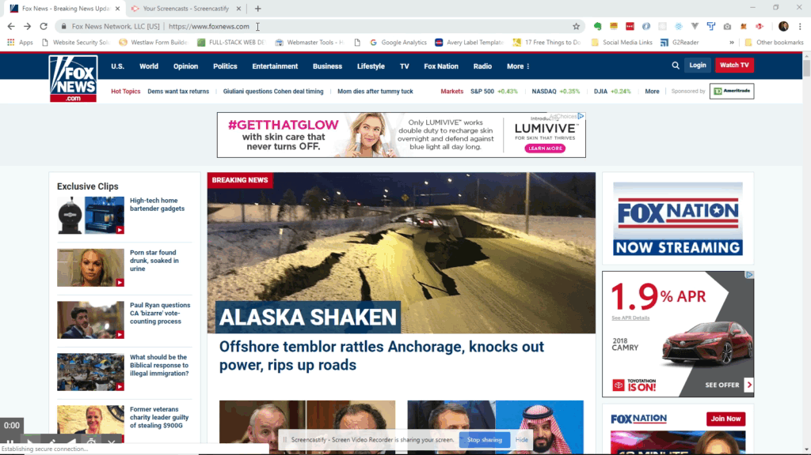
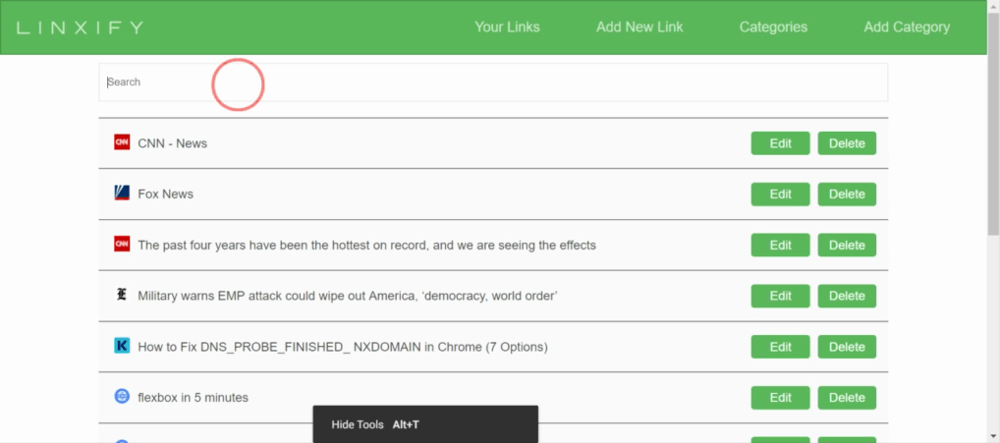
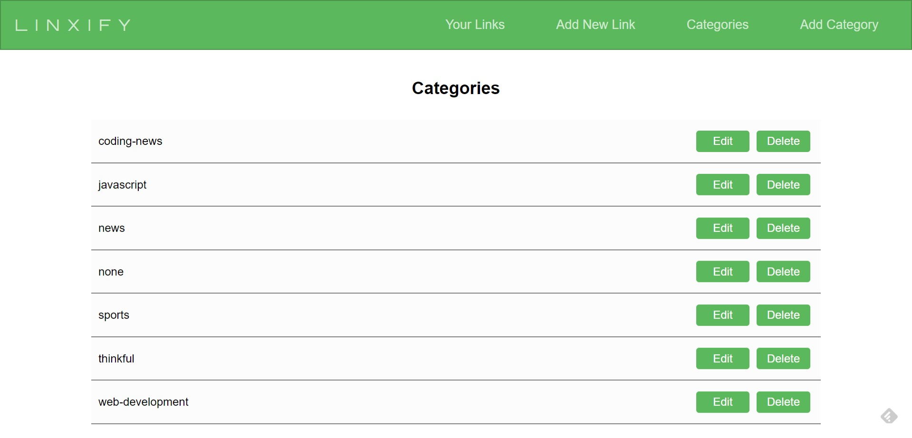

# Linxify - [https://www.linxify.net](https://www.linxify.net)

A simple, web-based app that allows you to save all of your bookmarks in the cloud. Just enter linxify.net/ before any url, and instantly save your bookmark.

Login
=====

Save a link while browsing the web
==================================

Simply enter `linxify.net/` in front of any URL and your link will be saved to the cloud and accessible from any device anywhere. Watch the example below for an illustration.  
  
To save a link with a category, after linxify.net/, simply add the category name followed by two dashes(--) , such as `linxify.net/news--https://www.foxnews.com`. Please note that no spaces are allowed in the category name.

  
  

Search for links
================

Use the search bar to filter your list of links. If the search entered is found in then URL or the title of a link, that will be displayed, while all others are filtered out.

  
  

Edit or add a link manually
===========================

You can also edit or add a link directly within the website, with the option to add some notes about the link you are entering.

  
  

View, edit and add categories
=============================

  
  

